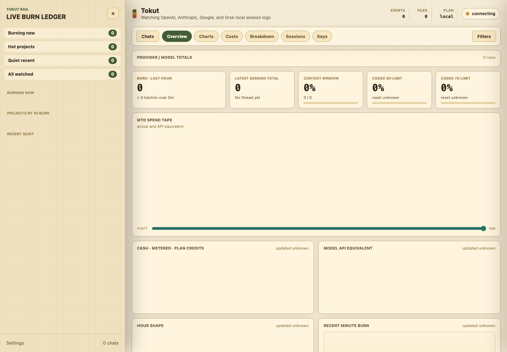
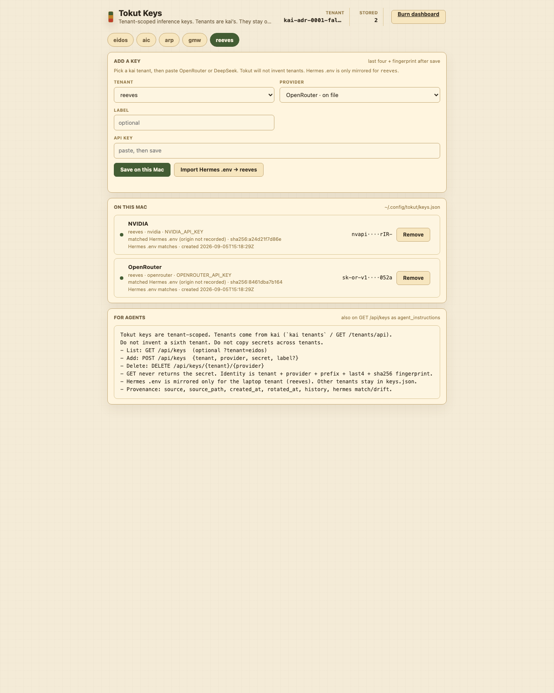

# Tokut

Tokut is a read-only local dashboard and **AI cost consultant** surface for live
token burn across:

- OpenAI Codex: `~/.codex/sessions/**/*.jsonl`
- Anthropic Claude Code: `~/.claude/projects/**/*.jsonl`
- Google Gemini CLI: `~/.gemini/tmp/*/chats/*.jsonl` and `*.json`
- **Grok Build:** `~/.grok/sessions/**/updates.jsonl` (`turn_completed` usage)

It does not call external services, read arbitrary files, or write into
provider accounts or billing. The one local write path is inference API keys
on `http://127.0.0.1:8766/keys`.

Domain law (meter vs cash, overage caps, server stamps): **`DOMAIN_RULES.md`**.

## Run

```bash
python run.py --port 8766
```

or, after editable install:

```bash
pip install -e .
tokut --port 8766
```

Then open:

```text
http://127.0.0.1:8766
http://127.0.0.1:8766/keys
```

## Screenshots

Burn dashboard (localhost):



Tenant-scoped keys page — last-four + fingerprint only, never the secret:




Cost consultant briefing (JSON):

```bash
python run.py consult
# or with server running:
curl -s http://127.0.0.1:8766/api/consult | python -m json.tool
```

## What It Shows

- Current thread total tokens and last-turn burn
- Provider tiles for OpenAI, Anthropic, Google, and Grok
- Account/root grouping for multiple local accounts
- Cached vs uncached input, output, reasoning, and tool tokens
- Rolling 5 minute, 30 minute, 1 hour, 5 hour, and 7 day burn
- Paid API/overage dollars stacked below subscription-covered theoretical dollars
- Overage **cash ceilings** (e.g. SuperGrok auto top-up monthly max)
- Company, account, project, model, user, day, and hour filters
- Project filters ordered by token count with token totals in labels
- Codex primary and secondary rate-limit percentages and reset countdowns
- Recent sessions sorted by latest token event
- **`/api/consult`** headline with meter / cash exposure / top burners

## Local Configuration

Private machine paths, account names, company mappings, and custom prices live
outside the repository.

By default Tokut looks for:

```text
~/.config/tokut/config.json
~/.config/tokut/subscriptions.json
~/.config/tokut/pricing.json
~/.config/tokut/keys.json
```

## Keys

Tokut stores inference API keys locally, **scoped by kai tenant**. Tenants are
whatever `kai tenants` / GET `/tenants/api` returns (eidos, aic, arp, gmw,
reeves). Tokut does not invent a sixth. The page is
`http://127.0.0.1:8766/keys`. Slots are vault adapters (`inline` plaintext or
`knox` handle). GET `/api/keys` returns backend, last-four / masked handle,
fingerprint (inline), source, and Hermes match/drift — never the secret.
Knox `resolve()` reports slot usability and the Fort Knox inject recipe
(`request` → `approve` → `invoke`); it does not unwrap or print a key.
Saving an inline key for `reeves` also mirrors the env var into
`~/.hermes/.env`. Other tenants stay in `keys.json` only.

```bash
python run.py keys list
python run.py keys import-hermes
python run.py keys put openrouter --from-env
python run.py keys put deepseek --backend knox --ref knox:<handle>
python run.py keys delete deepseek
```

Do not pass a secret on the command line. Use the page, `--from-env`, or
`--secret-file`.

or set:

```bash
export TOKUT_CONFIG_FILE=/path/to/tokut.config.json
```

Start from the committed templates:

```text
tokut.config.example.json
subscriptions.example.json
pricing.example.json
```

## Subscriptions, companies, and overage

Tokut estimates dollar views (see DOMAIN_RULES DR-001..DR-007):

1. **Meter** — full list/server value of observed burn
2. **Plan credits (discounted)** — burn within `included.allowance_usd` (subscription pool)
3. **Metered** — burn **above** the included allowance (cash-eligible)
4. **Cash exposure** — metered slice limited by `overage.monthly_cap_usd` or full API billing

Example account row:

```json
{
  "provider": "grok",
  "account": "default",
  "company": "Personal",
  "subscription": "SuperGrok",
  "plan": "SuperGrok",
  "billing_mode": "subscription",
  "included": {
    "period": "week",
    "allowance_usd": 200
  },
  "overage": {
    "mode": "auto_topup",
    "monthly_cap_usd": 50
  },
  "notes": "Plan credits up to $200 list-equiv/week; above that metered cash ≤ $50/mo auto top-up."
}
```

`billing_mode` can be `subscription`, `api_billed`, or `unknown`.

## Boundaries

Tokut is a monitoring and analysis tool, **not a billing authority**. Local logs
prove local burn (and sometimes server-stamped meters), not invoices. Treat cost
estimates as list-price or policy-based until reconciled against provider billing.

Read-only by default: no messages, no provider mutations, no billing changes.

## Agents

Use `skills/use-tokut/SKILL.md` as the agent contract: always separate meter vs
cash, prefer Tokut over freestyle provider log sums.
